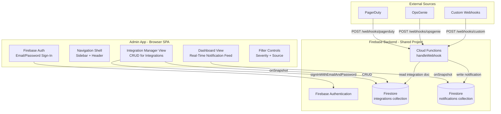
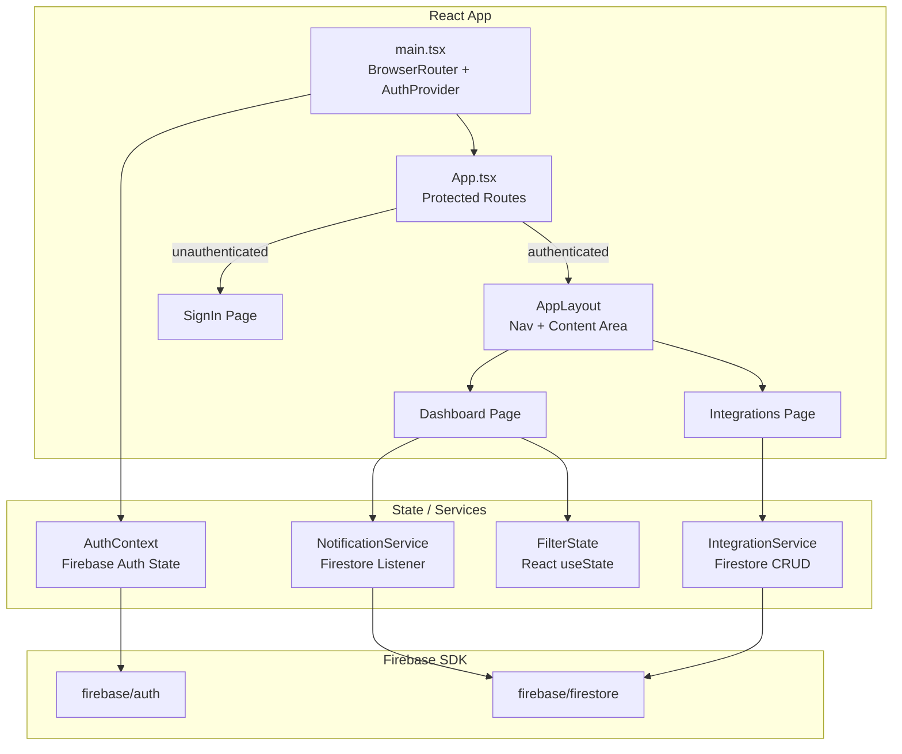
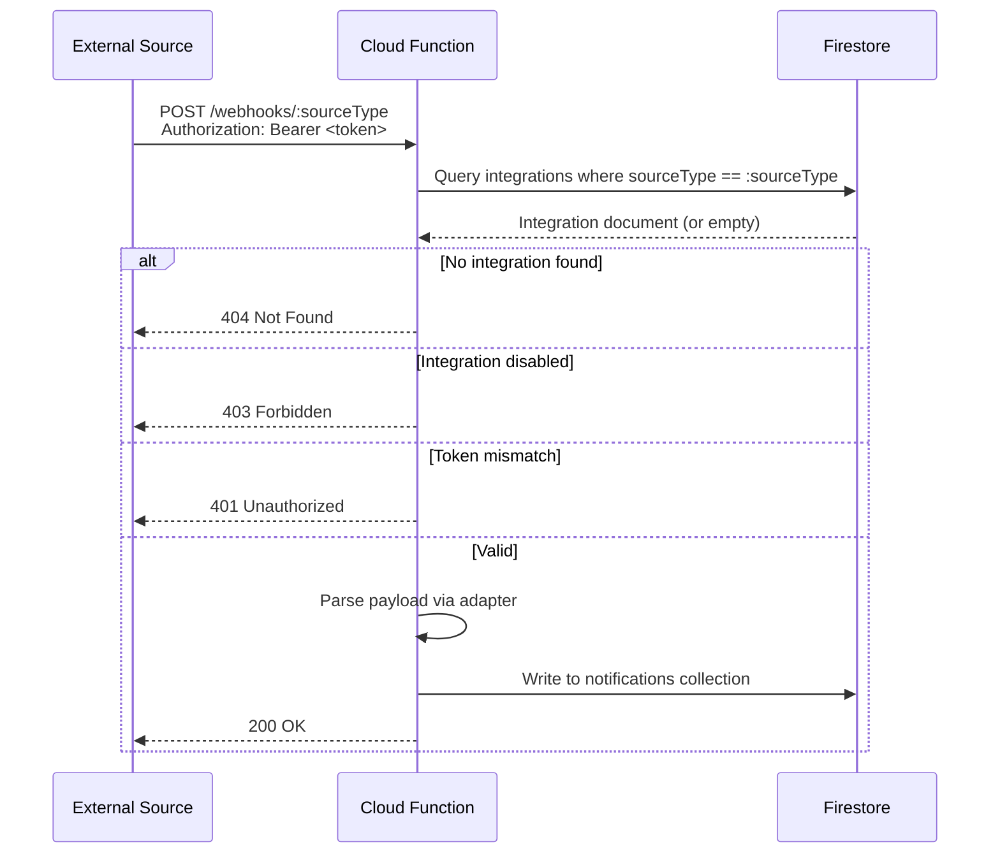
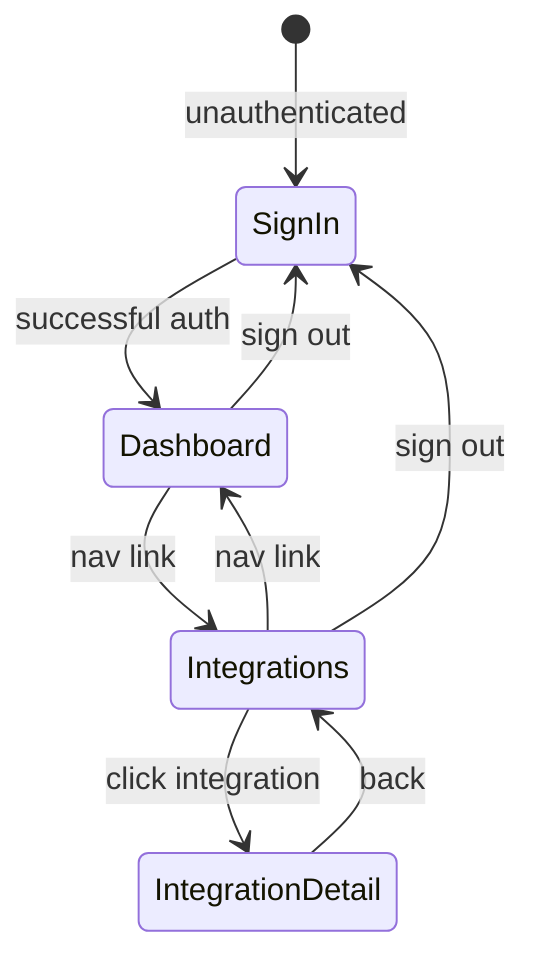

# Design Document: Admin App

## Overview

The Admin App is a standalone React single-page application that provides integration management and real-time notification monitoring for the Notification Hub system. It is a separate deployment from the G2 glasses WebView app but connects to the same Firebase project, sharing the Firestore `notifications` collection and Cloud Functions backend.

The system introduces three new concerns on top of the existing Notification Hub infrastructure:

1. **Integration management** — A new Firestore `integrations` collection stores per-source configuration (display name, source type, auth token, enabled status). The Admin App provides full CRUD for these documents.
2. **Per-integration webhook authentication** — The existing Cloud Functions webhook handler is updated to validate incoming requests against integration-specific bearer tokens stored in Firestore, replacing the single `WEBHOOK_AUTH_TOKEN` environment variable.
3. **Real-time notification dashboard** — The Admin App subscribes to the existing `notifications` collection via `onSnapshot` and renders a filterable, live-updating feed of the most recent 100 notifications.

### Key Design Decisions

- **Separate React SPA**: The Admin App is not embedded in the G2 glasses WebView. It runs in a standard browser, uses React Router for navigation, and is deployed independently (e.g., via Firebase Hosting or App Hosting). This keeps the glasses app lightweight and avoids coupling admin concerns to the constrained WebView environment.
- **Shared Firebase project**: The Admin App reuses the same Firebase project (Firestore, Cloud Functions, Auth). No additional backend infrastructure is needed. Firebase Auth gates access to the admin UI; Firestore Security Rules restrict the `integrations` collection to authenticated users.
- **Client-side token generation**: Auth tokens for integrations are generated client-side using `crypto.getRandomValues()` (Web Crypto API). This avoids a Cloud Function round-trip for token creation. Tokens are 32+ hex characters.
- **Firestore-driven webhook auth**: The webhook handler reads the `integrations` collection at request time to validate tokens and check enabled status. This eliminates the need for environment variable management when adding/removing sources.
- **Client-side filtering**: Dashboard filters (severity, source) are applied in-memory on the client after receiving the `onSnapshot` snapshot. The query fetches the latest 100 notifications unfiltered; filtering is purely a UI concern.



## Architecture

### System Components

The Admin App adds one new deployable unit and modifies one existing unit:

1. **Admin App (new)** — Vite + React + TypeScript SPA. Deployed as a static site via Firebase Hosting (or App Hosting). Uses Firebase JS SDK for Auth and Firestore.
2. **Cloud Functions (modified)** — The existing `handleWebhook` function is updated to read from the `integrations` collection for per-integration token validation and enabled/disabled checks.

### Admin App Architecture



### Updated Webhook Authentication Flow



### Navigation Flow



## Components and Interfaces

### Firebase Configuration (Admin App)

The Admin App creates its own Firebase app instance with Auth enabled, reusing the same project config as the glasses app:

```typescript
// admin/src/firebase/config.ts
import { initializeApp } from 'firebase/app'
import { getFirestore } from 'firebase/firestore'
import { getAuth } from 'firebase/auth'

const firebaseConfig = {
  apiKey: import.meta.env.VITE_FIREBASE_API_KEY,
  authDomain: import.meta.env.VITE_FIREBASE_AUTH_DOMAIN,
  projectId: import.meta.env.VITE_FIREBASE_PROJECT_ID,
  storageBucket: import.meta.env.VITE_FIREBASE_STORAGE_BUCKET,
  messagingSenderId: import.meta.env.VITE_FIREBASE_MESSAGING_SENDER_ID,
  appId: import.meta.env.VITE_FIREBASE_APP_ID,
}

const app = initializeApp(firebaseConfig)
export const db = getFirestore(app)
export const auth = getAuth(app)
```

### AuthContext

```typescript
interface AuthContextValue {
  /** Current Firebase user, null if not authenticated */
  user: User | null
  /** True while Firebase Auth is resolving initial state */
  loading: boolean
  /** Sign in with email and password */
  signIn: (email: string, password: string) => Promise<void>
  /** Sign out and clean up listeners */
  signOut: () => Promise<void>
}
```

The `AuthProvider` wraps the app, subscribes to `onAuthStateChanged`, and exposes auth state via React context. On sign-out, it calls all registered cleanup functions (Firestore listener unsubscribes) before calling `firebaseSignOut`.

### IntegrationService

Encapsulates all Firestore operations for the `integrations` collection:

```typescript
interface IntegrationService {
  /** Subscribe to all integrations, returns unsubscribe function */
  subscribe(callback: (integrations: Integration[]) => void): () => void

  /** Create a new integration, returns the created document with generated ID */
  create(input: CreateIntegrationInput): Promise<Integration>

  /** Update mutable fields of an existing integration */
  update(id: string, fields: UpdateIntegrationInput): Promise<void>

  /** Delete an integration by ID */
  delete(id: string): Promise<void>

  /** Regenerate the auth token for an integration */
  regenerateToken(id: string): Promise<string>
}

interface CreateIntegrationInput {
  displayName: string
  sourceType: 'pagerduty' | 'opsgenie' | 'custom'
  description?: string
}

interface UpdateIntegrationInput {
  displayName?: string
  description?: string
  enabled?: boolean
}
```

### NotificationService

Encapsulates the Firestore listener for the `notifications` collection:

```typescript
interface NotificationService {
  /** Subscribe to the latest 100 notifications, returns unsubscribe function */
  subscribe(callback: (notifications: Notification[]) => void): () => void
}
```

The listener uses `query(collection(db, 'notifications'), orderBy('timestamp', 'desc'), limit(100))` and calls the callback on each snapshot. Connection state is tracked via Firestore's `onSnapshotsInSync` or snapshot metadata (`fromCache`, `hasPendingWrites`).

### Token Generation

```typescript
/** Generate a cryptographically random hex token of at least 32 characters */
function generateAuthToken(): string {
  const bytes = new Uint8Array(32) // 32 bytes = 64 hex chars
  crypto.getRandomValues(bytes)
  return Array.from(bytes, b => b.toString(16).padStart(2, '0')).join('')
}
```

### Webhook URL Generation

```typescript
/** Build the webhook URL for an integration */
function buildWebhookUrl(sourceType: string): string {
  const baseUrl = import.meta.env.VITE_FUNCTIONS_BASE_URL
  return `${baseUrl}/handleWebhook/webhooks/${sourceType}`
}
```

### Integration Validation

```typescript
/** Validate an integration document from Firestore. Returns null if invalid. */
function parseIntegration(id: string, data: DocumentData): Integration | null {
  if (
    typeof data.displayName !== 'string' ||
    typeof data.sourceType !== 'string' ||
    typeof data.authToken !== 'string' ||
    typeof data.enabled !== 'boolean' ||
    typeof data.webhookUrl !== 'string' ||
    !data.createdAt
  ) {
    console.warn(`Invalid integration document: ${id}`)
    return null
  }
  return {
    id,
    displayName: data.displayName,
    sourceType: data.sourceType,
    description: data.description ?? '',
    authToken: data.authToken,
    enabled: data.enabled,
    webhookUrl: data.webhookUrl,
    createdAt: data.createdAt,
  }
}
```

### Notification Filtering

```typescript
type SeverityFilter = 'all' | 'critical' | 'warning-critical' | 'info'

interface DashboardFilterState {
  severity: SeverityFilter
  source: string | null // null = all sources
}

/** Apply filters to a notification list. Pure function. */
function filterNotifications(
  notifications: Notification[],
  filter: DashboardFilterState
): Notification[] {
  return notifications.filter(n => {
    const matchesSeverity =
      filter.severity === 'all' ||
      (filter.severity === 'critical' && n.severity === 'critical') ||
      (filter.severity === 'warning-critical' && (n.severity === 'critical' || n.severity === 'warning')) ||
      (filter.severity === 'info' && n.severity === 'info')

    const matchesSource = filter.source === null || n.sourceName === filter.source

    return matchesSeverity && matchesSource
  })
}

/** Extract distinct source names from notifications */
function getDistinctSources(notifications: Notification[]): string[] {
  return [...new Set(notifications.map(n => n.sourceName))].sort()
}
```

### Updated Webhook Handler (Cloud Functions)

The existing `handleWebhook` function is modified to replace the single `WEBHOOK_AUTH_TOKEN` check with per-integration Firestore lookups:

```typescript
// functions/src/webhook.ts — updated auth flow

/**
 * Look up the integration for a given sourceType and validate the bearer token.
 * Returns the integration if valid, or an error response object.
 */
async function validateIntegrationAuth(
  sourceType: string,
  authHeader: string | undefined
): Promise<
  | { ok: true; integration: IntegrationDoc }
  | { ok: false; status: number; error: string }
> {
  // Query integrations collection for matching sourceType
  const snapshot = await db
    .collection('integrations')
    .where('sourceType', '==', sourceType)
    .limit(1)
    .get()

  if (snapshot.empty) {
    return { ok: false, status: 404, error: `No integration configured for source type: ${sourceType}` }
  }

  const doc = snapshot.docs[0]
  const integration = doc.data() as IntegrationDoc

  if (!integration.enabled) {
    return { ok: false, status: 403, error: 'Integration is disabled' }
  }

  if (!authHeader || !authHeader.startsWith('Bearer ')) {
    return { ok: false, status: 401, error: 'Missing or invalid authorization header' }
  }

  const token = authHeader.slice('Bearer '.length)
  if (token !== integration.authToken) {
    return { ok: false, status: 401, error: 'Invalid authentication token' }
  }

  return { ok: true, integration }
}
```

### React Page Components

| Component | Route | Purpose |
|-----------|-------|---------|
| `SignInPage` | `/sign-in` | Email/password login form |
| `DashboardPage` | `/` (default) | Real-time notification feed with filters |
| `IntegrationsPage` | `/integrations` | Integration list with create button |
| `IntegrationDetailPage` | `/integrations/:id` | View/edit single integration |
| `AppLayout` | — (wrapper) | Sidebar nav + header with user email + sign-out |

### UI Feedback System

A lightweight toast/notification system for operation feedback:

```typescript
interface Toast {
  id: string
  type: 'success' | 'error'
  message: string
}

interface ToastContextValue {
  toasts: Toast[]
  showSuccess: (message: string) => void
  showError: (message: string) => void
  dismiss: (id: string) => void
}
```

Toasts auto-dismiss after 4 seconds. Error toasts persist until manually dismissed.

## Data Models

### Integration (Firestore Document)

```typescript
interface Integration {
  /** Firestore document ID */
  id: string
  /** Human-readable name for the integration */
  displayName: string
  /** Source type identifier: "pagerduty" | "opsgenie" | "custom" */
  sourceType: string
  /** Optional description */
  description: string
  /** Bearer token for webhook authentication, ≥32 hex characters */
  authToken: string
  /** Whether the integration is active */
  enabled: boolean
  /** Full webhook URL for this integration */
  webhookUrl: string
  /** When the integration was created */
  createdAt: Timestamp
}
```

### Firestore Schema — `integrations` Collection

| Field | Type | Notes |
|-------|------|-------|
| `displayName` | string | Required, non-empty |
| `sourceType` | string | One of: pagerduty, opsgenie, custom |
| `description` | string | Optional, defaults to empty string |
| `authToken` | string | 64 hex characters (32 bytes) |
| `enabled` | boolean | Defaults to true on creation |
| `webhookUrl` | string | Generated: `{baseUrl}/handleWebhook/webhooks/{sourceType}` |
| `createdAt` | timestamp | Firestore server timestamp |

### Firestore Schema — `notifications` Collection (Existing)

No changes to the existing schema. The Admin App reads from this collection using the same `Notification` type defined in `src/types/notification.ts`.

### Firestore Security Rules (Updated)

```
rules_version = '2';

service cloud.firestore {
  match /databases/{database}/documents {
    // Notifications: readable by anyone (glasses app), writable by Cloud Functions (admin SDK bypasses rules)
    match /notifications/{notificationId} {
      allow read: if true;
      allow write: if false; // Cloud Functions use admin SDK
    }

    // Integrations: only authenticated users can read/write
    match /integrations/{integrationId} {
      allow read, write: if request.auth != null;
    }
  }
}
```

### Notification (Existing — No Changes)

The Admin App reuses the existing `Notification` interface from `src/types/notification.ts`. The dashboard displays `severity`, `sourceName`, `title`, `body`, `sourceType`, and `timestamp`.

## Correctness Properties

*A property is a characteristic or behavior that should hold true across all valid executions of a system — essentially, a formal statement about what the system should do. Properties serve as the bridge between human-readable specifications and machine-verifiable correctness guarantees.*

### Property 1: Integration list item rendering contains required fields

*For any* valid Integration object, rendering it as a list item should produce output that contains the integration's displayName, sourceType, enabled/disabled status indicator, and a human-readable creation timestamp.

**Validates: Requirements 2.2**

### Property 2: Integration creation produces correct defaults

*For any* valid CreateIntegrationInput (non-empty displayName, valid sourceType, optional description), creating an integration should produce a document where: the authToken is at least 32 characters of hex, enabled is true, and webhookUrl equals the base URL concatenated with `/handleWebhook/webhooks/` and the sourceType.

**Validates: Requirements 3.3, 3.4**

### Property 3: Notification rendering contains required fields

*For any* valid Notification object, rendering it as a dashboard feed item should produce output that contains a severity indicator, the source name, the title, and a relative timestamp string.

**Validates: Requirements 7.3**

### Property 4: Source filter options match distinct sources

*For any* list of Notification objects, the set of source filter options should equal exactly the set of distinct `sourceName` values present in the list.

**Validates: Requirements 8.2**

### Property 5: Notification filtering correctness

*For any* list of Notification objects and any combination of severity filter and source filter, every notification in the filtered result should match the severity criteria AND the source criteria, and every notification in the original list that matches both criteria should appear in the filtered result.

**Validates: Requirements 8.3, 8.4, 8.5**

### Property 6: Filter count accuracy

*For any* list of Notification objects and any active filter combination, the displayed count string should report the exact number of filtered notifications and the exact total number of loaded notifications.

**Validates: Requirements 8.6**

### Property 7: Webhook URL generation

*For any* non-empty sourceType string, the generated webhook URL should equal the Cloud Functions base URL concatenated with `/handleWebhook/webhooks/` followed by the sourceType value.

**Validates: Requirements 10.2**

### Property 8: Integration round-trip serialization

*For any* valid Integration object, converting it to a Firestore document data format and then parsing it back via `parseIntegration` should produce an Integration object equivalent to the original.

**Validates: Requirements 10.1, 10.3**

### Property 9: Malformed integration document rejection

*For any* Firestore document data that is missing a required Integration field or has a field of the wrong type, `parseIntegration` should return null and log a warning.

**Validates: Requirements 10.4**

### Property 10: Webhook auth — missing integration returns 404

*For any* sourceType string that has no matching document in the `integrations` collection, the webhook handler should respond with HTTP 404.

**Validates: Requirements 11.2**

### Property 11: Webhook auth — invalid token returns 401

*For any* webhook request where the bearer token does not match the integration's stored authToken, the webhook handler should respond with HTTP 401.

**Validates: Requirements 11.3**

### Property 12: Webhook auth — disabled integration returns 403

*For any* webhook request targeting an integration where `enabled` is false, regardless of whether the bearer token is correct, the webhook handler should respond with HTTP 403.

**Validates: Requirements 5.4, 11.4**

## Error Handling

### Frontend Error Handling

| Scenario | Behavior |
|----------|----------|
| Firebase Auth sign-in failure | Display error message mapped from Firebase error code (invalid-credential, user-disabled, network-request-failed). Retain email input. |
| Firestore write failure (create/update/delete) | Display error toast with failure description. Retain user input so the operation can be retried. |
| Firestore listener disconnect | Display a warning banner at the top of the dashboard: "Connection lost — notification feed may be stale." |
| Firestore listener reconnect | Remove warning banner. The `onSnapshot` listener automatically re-syncs. |
| Malformed integration document | Skip the document in the list, log a warning to console. Do not crash the UI. |
| Network timeout on Firestore operations | Firebase SDK handles retries internally. If the operation ultimately fails, surface the error via toast. |

### Backend Error Handling (Updated Webhook Handler)

| Scenario | HTTP Status | Response Body |
|----------|-------------|---------------|
| Non-POST request | 405 | `{ error: "Method not allowed. Use POST." }` |
| No integration for sourceType | 404 | `{ error: "No integration configured for source type: {sourceType}" }` |
| Integration disabled | 403 | `{ error: "Integration is disabled" }` |
| Missing/invalid bearer token | 401 | `{ error: "Missing or invalid authorization header" }` |
| Token mismatch | 401 | `{ error: "Invalid authentication token" }` |
| Adapter parse failure | 422 | `{ error: "Failed to parse payload: {message}" }` |
| Firestore write failure | 500 | `{ error: "Failed to write notification to database" }` |

### Firebase Auth Error Code Mapping

| Firebase Error Code | User-Facing Message |
|--------------------|--------------------|
| `auth/invalid-credential` | "Invalid email or password." |
| `auth/user-disabled` | "This account has been disabled." |
| `auth/too-many-requests` | "Too many sign-in attempts. Please try again later." |
| `auth/network-request-failed` | "Network error. Check your connection and try again." |
| Other | "Sign-in failed. Please try again." |

## Testing Strategy

### Property-Based Testing

The Admin App uses **fast-check** (already compatible with the project's Vitest setup) for property-based testing. Each property test runs a minimum of 100 iterations.

**Applicable properties** (pure functions and data transformations):
- Properties 4–9 are directly testable as property-based tests against pure functions (`filterNotifications`, `getDistinctSources`, `buildWebhookUrl`, `parseIntegration`, `generateAuthToken`).
- Properties 1, 3 can be tested as property-based tests by rendering components with generated data and asserting on output content.
- Properties 10–12 are tested as property-based tests against the webhook auth validation function with mocked Firestore.
- Property 2 tests the integration creation service with generated inputs.

**Tag format**: `Feature: admin-app, Property {number}: {property_text}`

Each correctness property maps to a single property-based test.

### Unit Testing (Example-Based)

Unit tests cover specific scenarios, edge cases, and UI interactions:

- **Auth flow**: Sign-in success redirect, sign-in error display, sign-out cleanup, auth guard redirect
- **Integration CRUD**: Form validation (empty display name), create/edit/delete flows, confirmation dialogs, token reveal/mask toggle, copy-to-clipboard
- **Dashboard**: Severity color indicators, expand/collapse detail panel, single-panel-at-a-time constraint, connection status indicator, warning banner on disconnect/reconnect
- **Navigation**: Active nav item highlighting, route rendering, user email display

### Integration Testing

- **Firestore listeners**: Verify `onSnapshot` subscriptions are set up with correct queries and cleaned up on unmount/sign-out
- **Webhook handler**: End-to-end tests with Firebase emulators — create integration, send webhook, verify notification written

### Test Organization

```
admin/src/__tests__/
  properties/           # Property-based tests (fast-check)
    filterNotifications.prop.test.ts
    parseIntegration.prop.test.ts
    buildWebhookUrl.prop.test.ts
    generateAuthToken.prop.test.ts
    integrationCreation.prop.test.ts
    integrationListItem.prop.test.ts
    notificationFeedItem.prop.test.ts
    filterCount.prop.test.ts
    sourceFilterOptions.prop.test.ts
  unit/                 # Example-based unit tests
    SignInPage.test.tsx
    DashboardPage.test.tsx
    IntegrationsPage.test.tsx
    IntegrationDetailPage.test.tsx
    AppLayout.test.tsx
    toastContext.test.ts
functions/src/__tests__/
  webhook.test.ts       # Updated with per-integration auth tests
  properties/
    webhookAuth.prop.test.ts  # Properties 10-12
```
