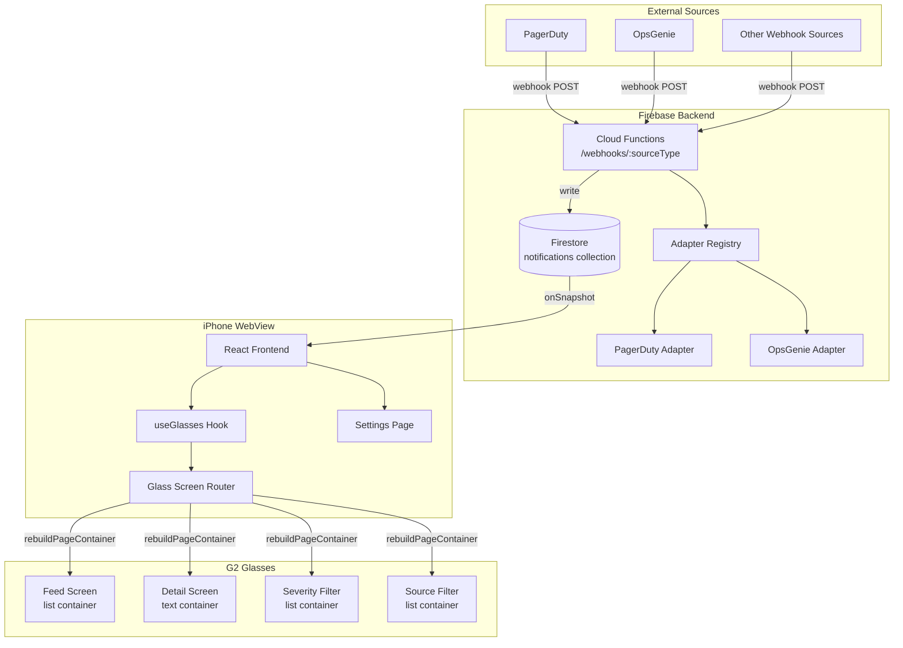
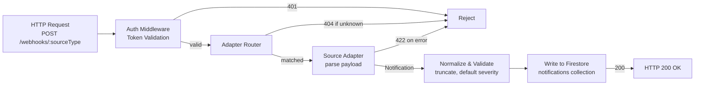
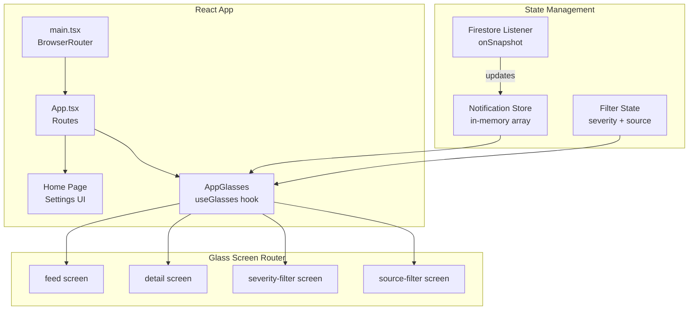
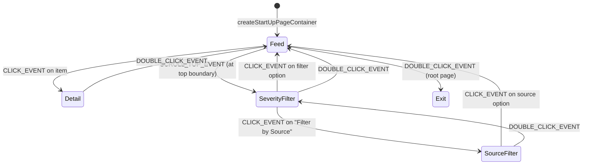

# Design Document: Notification Hub

## Overview

Notification Hub is a real-time notification aggregation system for Even Realities G2 smart glasses. It ingests webhooks from external services (PagerDuty, OpsGenie, etc.) via Firebase Cloud Functions, normalizes them into a consistent format, stores them in Firestore, and delivers them in real time to a glasses UI and a companion WebView settings page.

The system has three layers:

1. **Backend (Firebase Cloud Functions)** — HTTP-triggered functions that receive webhooks, route them through pluggable source adapters, normalize payloads, and write to Firestore.
2. **Frontend (Vite + React + TypeScript)** — Runs in the Even Hub WebView on iPhone. Subscribes to Firestore `onSnapshot` for real-time updates, manages glasses display state, and renders a settings page using even-toolkit.
3. **Glasses UI** — Rendered on the G2's 576×288 green micro-LED display via the SDK container model. Shows a notification feed (list container), detail views (text container), and filter screens (list containers). Navigated with R1 ring gestures.

### Key Design Decisions

- **Firebase as real-time backbone**: Cloud Functions handle webhook ingestion; Firestore provides real-time sync via `onSnapshot` — no custom WebSocket infrastructure needed.
- **Pluggable adapter pattern**: Each notification source implements a `SourceAdapter` interface. Adding a new source means adding one module — no changes to core ingestion logic.
- **even-toolkit `useGlasses` hook + glass-screen-router**: The existing codebase uses `even-toolkit`'s `createGlassScreenRouter` and `useGlasses` patterns. The notification hub extends this with new screens (feed, detail, severity filter, source filter) following the same architecture.
- **SDK Storage for persistence**: Filter preferences are stored via `bridge.setLocalStorage`/`bridge.getLocalStorage` (not browser `localStorage`, which doesn't survive app restarts in the `.ehpk` WebView).
- **List containers for feed and filters, text container for detail**: List containers provide native firmware scrolling for the feed and filter screens. Text containers with `isEventCapture: 1` provide internal scroll for long notification detail text.



## Architecture

### System Components

The system is split into two deployable units:

1. **Firebase project** — Cloud Functions (Node.js/TypeScript) + Firestore database
2. **Frontend app** — Vite + React + TypeScript, deployed as a static site and loaded in the Even Hub WebView

### Backend Architecture (Cloud Functions)



**Webhook Function**: A single HTTP-triggered Cloud Function handles all webhook sources. The `:sourceType` path parameter routes to the correct adapter.

**Authentication**: Each webhook source is configured with a bearer token. The function validates the `Authorization` header before processing. Invalid/missing tokens get HTTP 401.

**Adapter Registry**: A `Map<string, SourceAdapter>` that maps source type strings to adapter instances. Looked up at request time — O(1) routing.

**Normalization Pipeline**: After adapter parsing, the function truncates title (120 chars) and body (400 chars), validates severity (defaults to `info` if invalid), and assigns a Firestore server timestamp.

### Frontend Architecture



**Notification Store**: An in-memory array of the most recent 50 notifications, kept in sync with Firestore via `onSnapshot`. The listener queries `notifications` ordered by `timestamp` descending, limited to 50.

**Filter State**: Severity filter (`all` | `critical` | `warning+critical`) and source filter (`all` | specific source name). Persisted to SDK Storage. Applied client-side to the in-memory notification array before rendering.

**Glass Screen Router**: Extends the existing `createGlassScreenRouter` pattern with four screens: `feed`, `detail`, `severity-filter`, `source-filter`. Each screen defines `display()` and `action()` methods following the even-toolkit convention.

### Navigation Flow



- **Feed** is the root screen. Double-click calls `shutDownPageContainer(1)` for the Even Hub exit dialogue.
- **Detail** is reached by clicking a notification in the feed. Double-click returns to feed.
- **Severity Filter** is reached by scrolling to the top boundary of the feed (SCROLL_TOP_EVENT). Double-click returns to feed.
- **Source Filter** is reached from the severity filter screen. Double-click returns to severity filter.

## Components and Interfaces

### Backend Components

#### SourceAdapter Interface

```typescript
interface SourceAdapter {
  /** Unique identifier matching the :sourceType URL parameter */
  readonly sourceType: string

  /**
   * Parse a raw webhook payload into a normalized Notification.
   * Throws if the payload is malformed or missing required fields.
   */
  parse(rawPayload: unknown): ParsedNotification
}

/** Output of adapter parsing, before backend normalization */
interface ParsedNotification {
  title: string
  body: string
  severity: string
  sourceName: string
  sourceType: string
}
```

#### AdapterRegistry

```typescript
class AdapterRegistry {
  private adapters: Map<string, SourceAdapter> = new Map()

  register(adapter: SourceAdapter): void
  get(sourceType: string): SourceAdapter | undefined
  has(sourceType: string): boolean
}
```

#### Built-in Adapters

- **PagerDutyAdapter** (`sourceType: 'pagerduty'`): Parses PagerDuty V2 webhook events. Maps `incident.trigger` → critical, `incident.acknowledge` → warning, `incident.resolve` → info.
- **OpsGenieAdapter** (`sourceType: 'opsgenie'`): Parses OpsGenie webhook alerts. Maps alert priority P1/P2 → critical, P3 → warning, P4/P5 → info.

#### Webhook Handler

```typescript
// Cloud Function: POST /webhooks/:sourceType
async function handleWebhook(req: Request, res: Response): Promise<void>
```

Responsibilities:
1. Validate auth token from `Authorization: Bearer <token>` header
2. Look up adapter by `req.params.sourceType`
3. Call `adapter.parse(req.body)`
4. Normalize: truncate title/body, validate severity, add server timestamp
5. Write to Firestore `notifications` collection
6. Respond with HTTP 200

### Frontend Components

#### NotificationStore

```typescript
interface NotificationStore {
  /** Current notifications, ordered newest-first, max 50 */
  notifications: Notification[]

  /** Subscribe to Firestore onSnapshot, returns unsubscribe function */
  subscribe(): () => void

  /** Get filtered notifications based on current filter state */
  getFiltered(filter: FilterState): Notification[]
}
```

#### FilterState

```typescript
type SeverityFilter = 'all' | 'critical' | 'warning-critical'

interface FilterState {
  severity: SeverityFilter
  source: string | null  // null = all sources
}
```

#### Glass Screens

Each screen follows the even-toolkit `GlassScreen<AppSnapshot, AppActions>` interface:

| Screen | Container Type | isEventCapture | Purpose |
|--------|---------------|----------------|---------|
| `feed` | ListContainer | 1 | Scrollable notification list, max 50 items |
| `detail` | TextContainer | 1 | Full notification text with internal scroll |
| `severity-filter` | ListContainer | 1 | Filter options: All, Critical Only, Warning & Critical |
| `source-filter` | ListContainer | 1 | Dynamic list of sources + "All Sources" |

#### Feed Screen List Item Format

Each list item is a single line, max 64 characters:

```
[severity] source: truncated title...
```

Severity indicators using available Unicode glyphs:
- Critical: `▲` (U+25B2)
- Warning: `◆` (U+25C6)
- Info: `●` (U+25CF)

Example: `▲ PagerDuty: Database connection pool exhausted on prod-db-0...`

#### Detail Screen Text Format

```
[severity icon] [SEVERITY]
Source: [sourceName]
Time: [formatted timestamp]
────────────────────────
[title]

[body]
```

Uses `━` (U+2501) for the separator line. Content rendered in a full-screen text container (576×288) with `isEventCapture: 1` for internal scrolling of long bodies.

#### Critical Notification Banner

When a critical notification arrives while viewing a detail screen, a temporary banner is shown by:
1. Calling `textContainerUpgrade` to prepend a banner line: `▲ NEW CRITICAL: [title snippet]`
2. Setting a 3-second timer
3. Restoring the original detail text via `textContainerUpgrade` after the timer

This avoids a full `rebuildPageContainer` and the associated flicker.

#### WebView Settings Page

Built with even-toolkit web components:

```typescript
// Settings page structure
<AppShell header={<NavHeader title="Notification Hub" />}>
  <ScreenHeader title="Settings" />

  {/* Connection Status */}
  <Card>
    <ListItem
      title="Firestore Connection"
      subtitle={connectionStatus}  // "Connected" | "Disconnected"
      trailing={<StatusDot status={isConnected ? 'positive' : 'negative'} />}
    />
  </Card>

  {/* Configured Sources */}
  <SectionHeader title="Webhook Sources" />
  <Card>
    {sources.map(source => (
      <ListItem
        key={source.type}
        title={source.name}
        subtitle={source.webhookUrl}
        trailing={<Button size="sm" onClick={() => copyToClipboard(source.webhookUrl)}>
          <IcCopy />
        </Button>}
      />
    ))}
  </Card>
</AppShell>
```

#### Notification Queue (BLE Disconnect Resilience)

```typescript
interface NotificationQueue {
  /** Queue notifications when BLE is disconnected */
  enqueue(notification: Notification): void

  /** Flush queued notifications to display when BLE reconnects */
  flush(): Notification[]

  /** Check if there are queued notifications */
  readonly pending: number
}
```

When the glasses BLE connection is lost (detected via `bridge.onDeviceStatusChanged`), incoming Firestore notifications are queued in memory. When the connection is restored, the queue is flushed and the feed is rebuilt with the latest state.

## Data Models

### Notification (Firestore Document)

```typescript
interface Notification {
  /** Firestore auto-generated document ID */
  id: string

  /** Notification title, max 120 characters */
  title: string

  /** Notification body, max 400 characters */
  body: string

  /** Severity level */
  severity: 'critical' | 'warning' | 'info'

  /** Human-readable source name (e.g., "PagerDuty", "OpsGenie") */
  sourceName: string

  /** Source type identifier matching the adapter (e.g., "pagerduty") */
  sourceType: string

  /** UTC timestamp of when the notification was received */
  timestamp: FirebaseFirestore.Timestamp
}
```

### Firestore Schema

**Collection**: `notifications`

| Field | Type | Index | Notes |
|-------|------|-------|-------|
| `id` | string | auto | Document ID |
| `title` | string | — | Max 120 chars, truncated by backend |
| `body` | string | — | Max 400 chars, truncated by backend |
| `severity` | string | single | One of: critical, warning, info |
| `sourceName` | string | single | Human-readable source name |
| `sourceType` | string | — | Adapter identifier |
| `timestamp` | timestamp | single (desc) | Firestore server timestamp, primary sort key |

**Composite index**: `timestamp` (descending) — used by the frontend's initial query (`orderBy('timestamp', 'desc').limit(50)`).

### Filter State (SDK Storage)

Persisted as two SDK Storage keys:

| Key | Value | Default |
|-----|-------|---------|
| `notification-hub:severity-filter` | `'all'` \| `'critical'` \| `'warning-critical'` | `'all'` |
| `notification-hub:source-filter` | source name string \| `''` (empty = all) | `''` |

### AppSnapshot (Glass State)

```typescript
interface AppSnapshot {
  /** All notifications from Firestore, newest first, max 50 */
  notifications: Notification[]

  /** Currently applied filters */
  filter: FilterState

  /** Filtered notifications (derived from notifications + filter) */
  filteredNotifications: Notification[]

  /** Currently selected notification for detail view */
  selectedNotification: Notification | null

  /** Whether a critical banner is currently showing */
  criticalBannerActive: boolean

  /** BLE connection status */
  bleConnected: boolean

  /** Firestore listener connection status */
  firestoreConnected: boolean

  /** Flash phase for splash screen */
  flashPhase: boolean

  /** Set of unique source names from all notifications */
  availableSources: string[]
}
```

### AppActions

```typescript
interface AppActions {
  navigate: (path: string) => void
  setSeverityFilter: (filter: SeverityFilter) => void
  setSourceFilter: (source: string | null) => void
  selectNotification: (notification: Notification) => void
}
```
